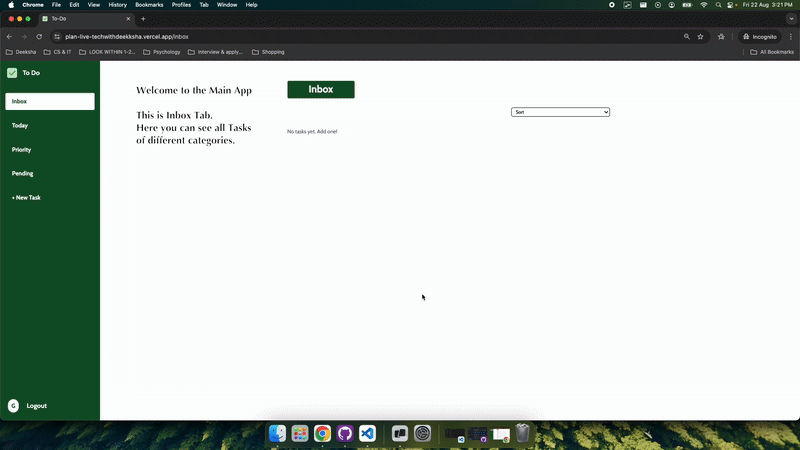
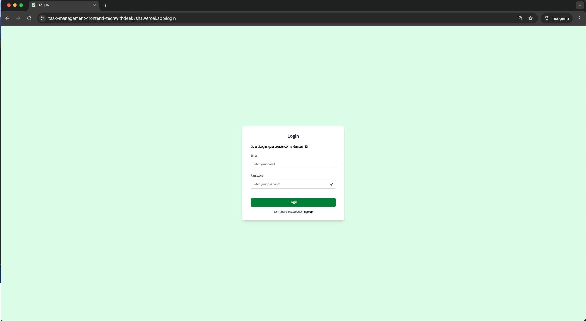
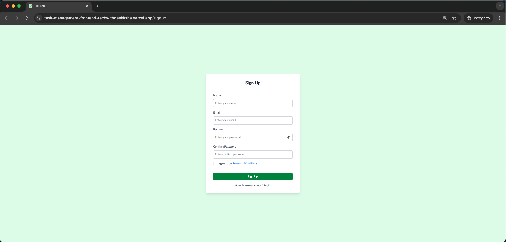
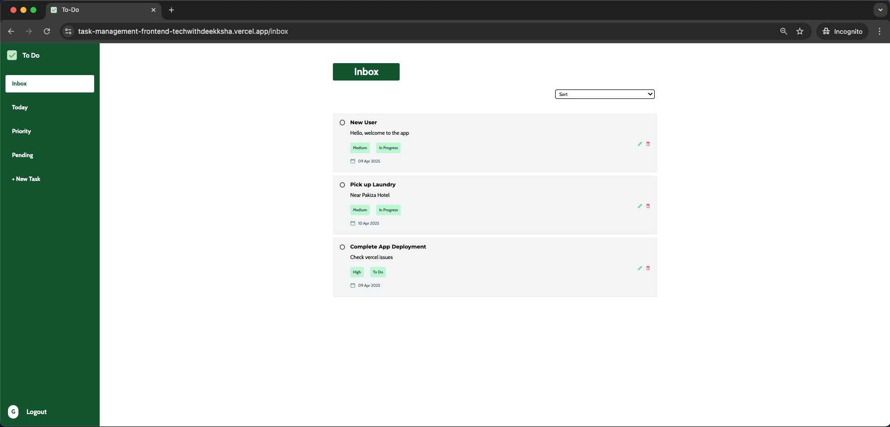
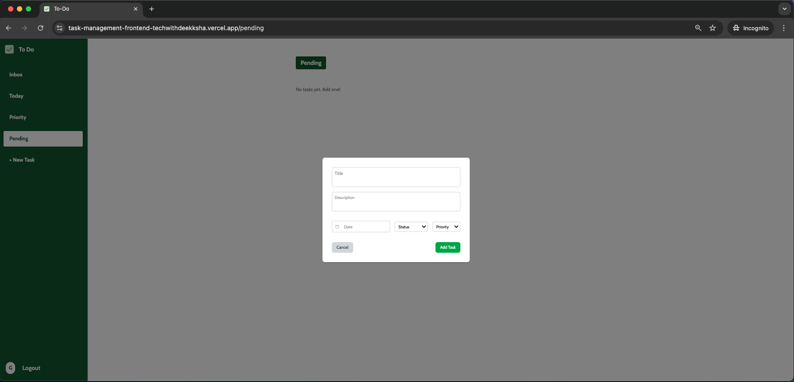
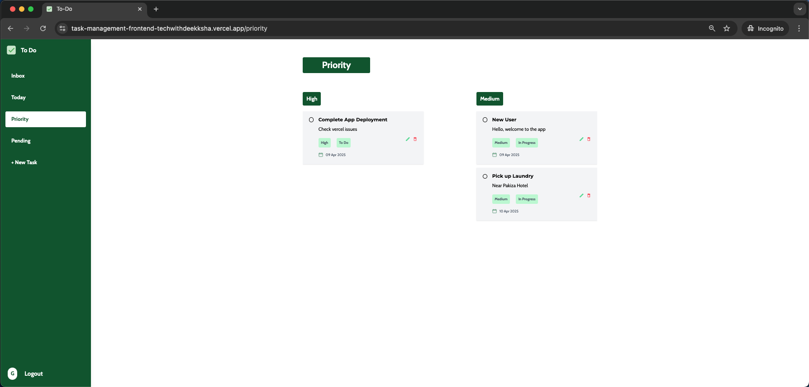
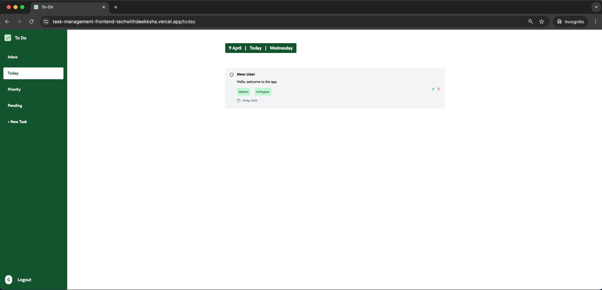

# 📝 Task Management App

[](https://github.com/404notDeeksha/Task-Management-App/blob/main/LICENSE)

Welcome to the **Task Management App** — a sleek and responsive task management interface built using **React + Vite**, styled with **TailwindCSS**, and powered by a secure **authenticated Node.js/Express backend**.

<br />

## 🔗 Live Demo

| Frontend | Backend |
|----------|---------|
| [https://plan-live-techwithdeekksha.vercel.app](https://plan-live-techwithdeekksha.vercel.app) | [https://plan-dep-techwithdeekksha.vercel.app](https://plan-dep-techwithdeekksha.vercel.app) |

## 🎬 Quick Demo

[](https://www.youtube.com/watch?v=nOcQAmmzf9o)

## 📂 Backend Repository

[](https://github.com/404notDeeksha/Task-Management-App-Backend)

<br />

## 🚀 Tech Stack

| Frontend | Backend & Deployment |
|----------|---------------------|
|  React 18 |  Node.js |
|  Vite 6 |  Express |
|  TailwindCSS 4 |  Vercel |
|  Redux Toolkit | |

<br />

## ✨ Features

### 🔐 Authentication
- User registration and login
- JWT-based secure authentication
- Protected routes with automatic redirect
- Session persistence via Redux Persist

### 📝 Task Management
- Create, edit, and delete tasks
- Set task priority (High, Medium, Low)
- Due date assignment with date picker
- Mark tasks as complete/incomplete

### 📂 Task Views
- **Inbox** — All tasks
- **Today** — Tasks due today
- **Pending** — Upcoming tasks
- **Priority** — Tasks sorted by priority

### 🔍 Search & Sort
- Real-time task search
- Sort by date, priority, or progress
- Filter tasks by status

### 🎨 UI/UX
- Fully responsive design
- Loading states with spinners
- Error boundaries for graceful failures
- Modal-based task creation/editing
- Toast notifications (via form validation)

### 🧪 Testing
- Unit tests with Vitest
- Component testing with React Testing Library

<br />

## 📸 Screenshots

| Login | Signup |
|-------|--------|
|  |  |

| Inbox | New Task |
|-------|----------|
|  |  |

| Priority | Today |
|----------|-------|
|  |  |

<br />

## 🏗️ Project Structure

```
src/
├── api/               # API integration (axios, auth, tasks)
├── components/        # Reusable UI components
│   ├── ErrorBoundary.jsx
│   ├── Modal.jsx
│   ├── NewTask.jsx
│   ├── Portal.js
│   ├── ProtectedRoute.jsx
│   ├── SideNavbar.jsx
│   ├── TaskForm.jsx
│   ├── TaskList.jsx
│   └── TaskSorter.jsx
├── pages/             # Route pages (Login, Signup, Inbox, etc.)
├── redux/             # Redux state management
│   └── slices/        # Auth, tasks, loading, search, modal slices
├── routes/            # React Router configuration
└── utils/             # Helper functions and utilities
```

<br />

## 🧪 Installation

```bash
# 1. Clone the repository
git clone https://github.com/404notDeeksha/Task-Management-App
cd Task-Management-App

# 2. Install dependencies
npm install

# 3. Set up environment variables
# Create .env file and add:
VITE_API_URL=your_backend_api_url

# 4. Start development server
npm run dev

# 5. Run tests (optional)
npm test
```

> ⚠️ **Note:** Ensure your backend server is running before starting the frontend.

<br />

## 📦 Available Scripts

| Command | Description |
|---------|-------------|
| `npm run dev` | Start development server |
| `npm run build` | Build for production |
| `npm run preview` | Preview production build |
| `npm run lint` | Run ESLint |
| `npm test` | Run tests with watch mode |
| `npm run test:run` | Run tests once |
| `npm run test:coverage` | Run tests with coverage |

<br />

## 🎓 What I Learned

- **State Management** — Redux Toolkit with slices, async thunks, and persistence
- **Authentication** — JWT-based auth with protected routes
- **API Integration** — Axios with interceptors for requests/responses
- **Form Handling** — React Hook Form for validation
- **Error Handling** — React Error Boundary for graceful fallbacks
- **Testing** — Vitest + React Testing Library
- **Routing** — React Router v7 with nested routes
- **Deployment** — Full-stack deployment on Vercel

<br />

## 📄 License

This project is licensed under the MIT License — see the [LICENSE](/LICENSE.md) file for details.

<br />

## 👋 Connect With Me

[](mailto:deeksha.developer@proton.me)
[](https://github.com/404notDeeksha)
[](https://www.linkedin.com/in/deek1995)